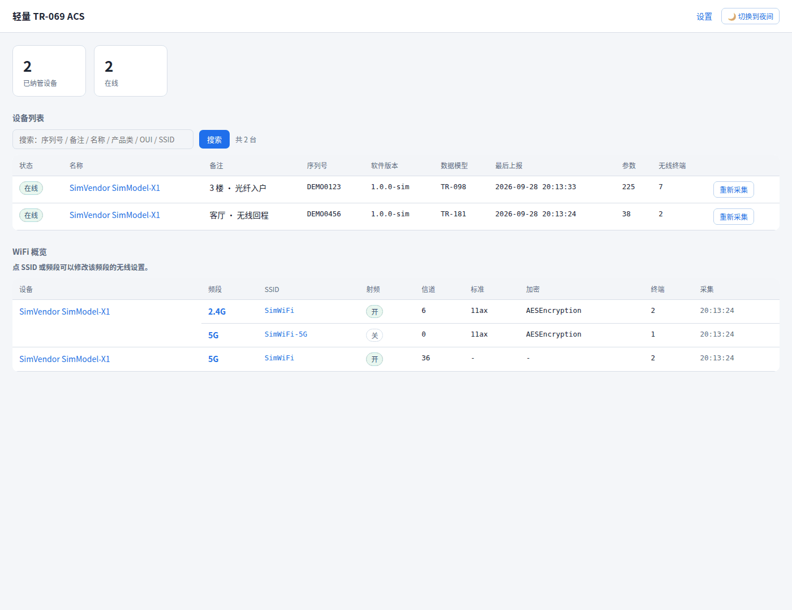
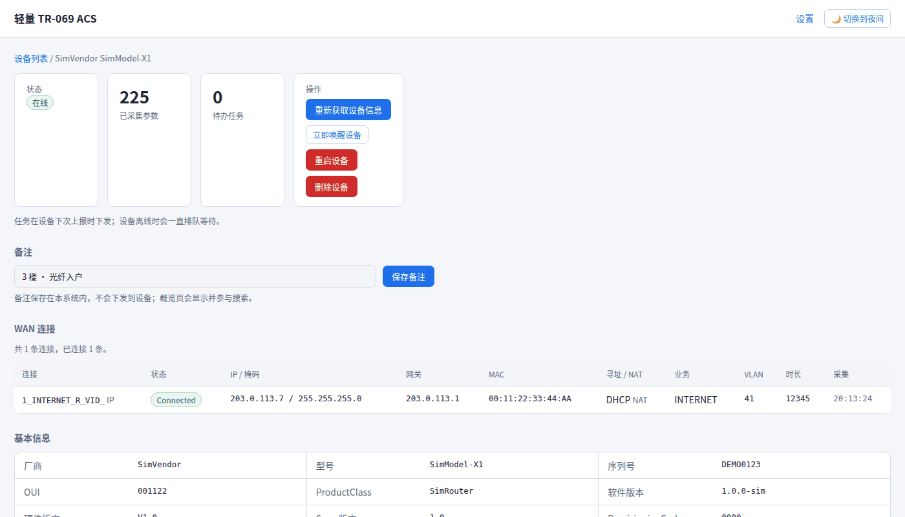
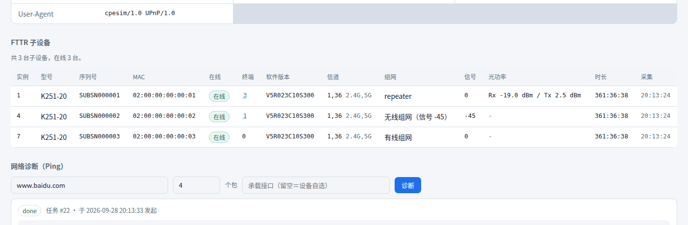
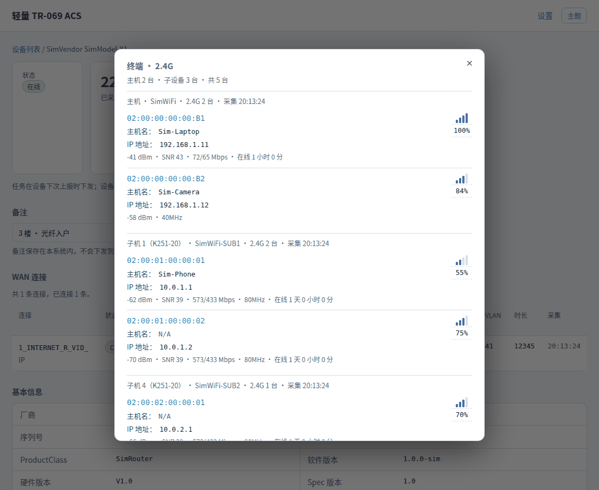
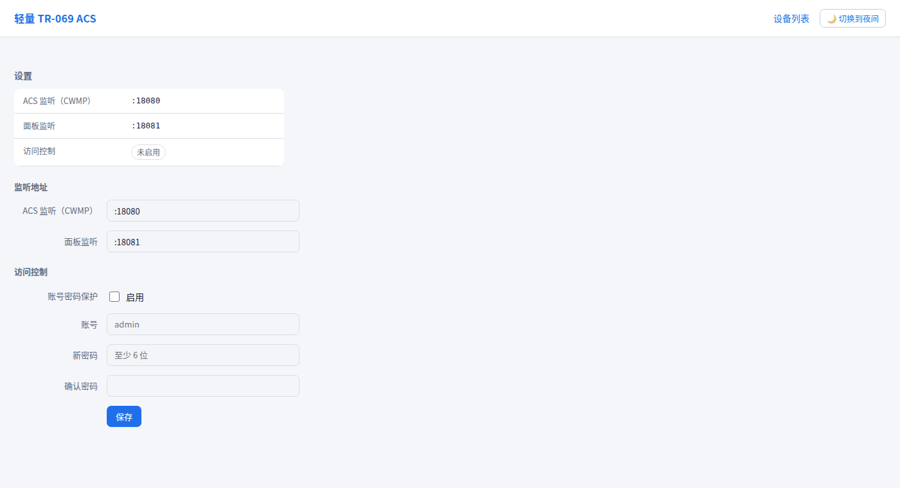

# 轻量 TR-069 ACS

单二进制、零外部中间件的 TR-069/CWMP ACS（Go + SQLite），用来管一批光猫 / FTTR 主机：
**纳管 → 看信息 → 改配置 → 诊断 → 子设备与终端管理**。


## 特点

- **单文件部署**：一个静态二进制 + 一个 SQLite 文件，没有 Redis / MySQL / 消息队列
- **只用标准协议**：Inform、GetParameterValues / Names、SetParameterValues、GetRPCMethods、Reboot、
  IPPingDiagnostics、Connection Request（含 HTTP Digest）；不依赖任何厂商私有服务
- **先探测再显示**：能力探测决定界面出现哪些区块（WAN、FTTR 子设备…），探测不到就整块不显示，不摆空壳
- **如实呈现设备行为**：能改不能读的参数、异步生效的无线参数、设备没上报的字段（显示 `N/A`），不编数字
- **可运维**：任务队列持久化、一键唤醒设备、重启 / 删除设备、面板账号密码、任务与上报记录的保留上限

## 截图

> 数据来自仓库自带的 CPE 模拟器，不含任何真实设备信息。

概览：设备列表（状态 / 备注 / 数据模型 / 参数数 / 无线终端数）+ 无线概况



设备详情：基本信息、WAN 连接、操作（唤醒 / 重启 / 删除）、备注



FTTR 子设备与网络诊断：子设备型号 / 组网模式 / 光功率 / 各自终端数，诊断由设备自己发 ICMP



终端列表：按「主机 / 子机」分组，带信号强度、终端名与 IP（设备没上报就写 `N/A`）



设置：ACS 与面板各自的监听地址、面板账号密码保护（端口改动重启生效，账号密码立即生效）



## 快速开始

```bash
go build -o acs ./cmd/acs        # Go 1.27+；CGO_ENABLED=0 可得到静态二进制
./acs -listen :9090 -db acs.db   # 面板 http://<IP>:9090/ ，CWMP http://<IP>:9090/acs
```

设备侧的 ACS URL 填 `http://<IP>:9090/acs`；真机里也见过配成根路径 `/` 的，所以两者都收。
面板挪到独立端口（`-web-listen :8080`）时，CWMP 那侧**任何路径都受理**，不用担心运营商定制设备的路径写法。

没有设备也能玩：仓库自带模拟器（含 FTTR 子设备、能改不能读、异步诊断等开关）。

```bash
go build -o cpesim ./test/cpesim
./cpesim -acs http://127.0.0.1:9090/acs -serial DEMO0123 -fttr 3 -fttr-optical
```

## 配置

命令行参数与环境变量一一对应（环境变量名 = `ACS_` + 参数名大写、连字符换下划线）。

| 参数 | 环境变量 | 默认 | 说明 |
| --- | --- | --- | --- |
| `-listen` | `ACS_LISTEN` | `:7547` | CWMP 监听地址 |
| `-web-listen` | `ACS_WEB_LISTEN` | 空 | 面板监听地址；留空 = 与 CWMP 同端口 |
| `-path` | `ACS_PATH` | `/acs` | CWMP 端点路径（同端口时生效） |
| `-db` | `ACS_DB` | `acs.db` | SQLite 文件路径 |
| `-user` / `-password` | `ACS_USER` / `ACS_PASSWORD` | 空 | 设备侧 HTTP 认证（CPE 基本认证）|
| `-web-user` / `-web-pass` | `ACS_WEB_USER` / `ACS_WEB_PASS` | 空 | 面板账号密码（首次启动种入，之后以设置页为准）|
| `-max-params-per-request` | `ACS_MAX_PARAMS_PER_REQUEST` | `200` | 单次 GetParameterValues 带多少个参数名 |
| `-task-history-limit` | `ACS_TASK_HISTORY_LIMIT` | `500` | 每台设备保留多少条任务记录（`0` = 不限）|
| `-inform-history-limit` | `ACS_INFORM_HISTORY_LIMIT` | `500` | 每台设备保留多少条上报记录（`0` = 不限）|
| `-auto-fetch-wifi` | `ACS_AUTO_FETCH_WIFI` | `true` | 纳管时自动采集无线概况与主机列表 |
| `-probe-capabilities` | `ACS_PROBE_CAPABILITIES` | `true` | 纳管时做一次能力探测（决定界面区块）|
| `-log-level` | `ACS_LOG_LEVEL` | `info` | `debug` / `info` / `warn` / `error` |
| `-log-soap` | `ACS_LOG_SOAP` | `false` | 打印原始 SOAP 报文（排障用）|

## 验收

```bash
go test ./...                   # 单元测试：协议解析 / 存储 / Web
bash scripts/verify-s1.sh       # 端到端 293 项：模拟器打真实 HTTP + SOAP，逐条断言
bash scripts/verify-interop.sh  # 与 GenieACS 官方 JS 模拟器互通 8 项
```

## 目录

```
cmd/acs/            程序入口（监听、优雅退出、双端口路由）
internal/cwmp/      协议核心：SOAP 编解码、会话、任务、诊断、Connection Request
internal/store/     SQLite：设备 / 参数 / 任务 / 上报记录（迁移走 user_version）
internal/web/       Web UI 与 JSON API（模板 + 少量原生 JS，无前端框架）
test/cpesim/        自研 CPE 模拟器（大量开关，验收靠它）
scripts/            验收脚本、参考实现拉取、开发用起停脚本
docs/               需求文档与实现笔记
```

## 更多

- `docs/requirements.md` —— 需求与实现进度
- `docs/notes/implementation-notes.md` —— **真机踩坑与实测记录**：协议边界（单次 GetParameterValues 上限、
  写回类型大小写、诊断要最后置 `Requested`）、设备怪癖（能改不能读、异步生效、身份键被元数据改写）、
  运维坑（挂载掉了不能乱删、任务别卡在 running）……修法与验证都在里面

仓库里的真机样本与文档**均已脱敏**（序列号、MAC、SSID、内网地址、终端名换成示例值）；
运行时数据库 `data/` 与日志不进仓库。

## 许可证

[AGPL-3.0](LICENSE)。可以自由使用、修改、分发（含商用）；但把**修改后**的版本作为网络服务提供给别人用时，
需要把对应源码以同样许可开放。
